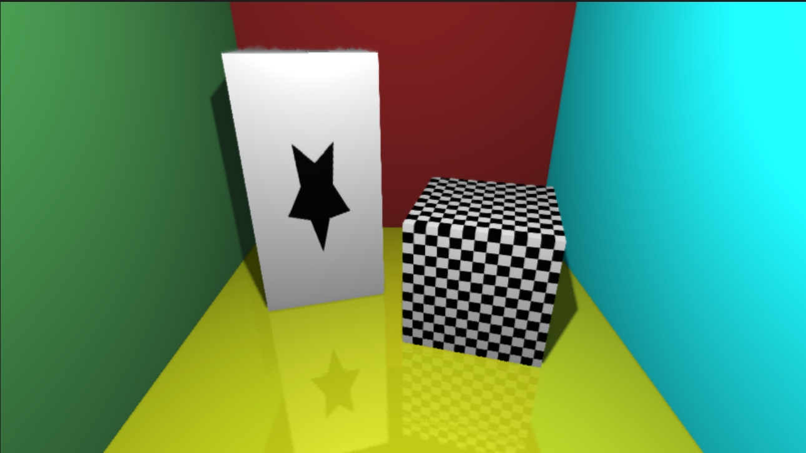

# Rasterizer
A lightweight C++20 software rasterizer with no third-party dependencies.

## Features
- **No External Libraries** – Pure C++20 implementation.
- **Deferred Rendering** – Efficient lighting and shading.
- **Global Illumination** – Supports advanced techniques:
  - Reflective Shadow Maps (RSM)
  - Screen Space Reflections (SSR)
  - Screen Space Ambient Occlusion (SSAO)
- **Texture Sampling** – Supports uv coordinates.
- **Normal Mapping** – Enhances surface detail.
- **Exponential Fog** – Realistic atmospheric effects.
- **Shadow Mapping** – Real-time shadow rendering.
- **Anti-Aliasing** – High-quality edge smoothing.
  - Super Sampling Anti-Aliasing (SSAA)
  - Fast Approximate Anti-Aliasing (FXAA)
- **Performance Optimization** – Utilizes OpenMP and tile-based rendering.

## Build
I can compile successfully on Windows using MSVC (VS 2022) and GCC (MinGW). 

### Visual Stduio 2022
```sh
cmake -G "Visual Studio 17 2022" -B build
cmake --build build --config Release
```

### MinGW
```sh
cmake -G "MinGW Makefiles" -DCMAKE_BUILD_TYPE=Release -B build
cd build
mingw32-make.exe
```

The program uses std::cout to output in PPM (P3) format and outputs to a .ppm file using the following command line.
```sh
.\rasterizer.exe > xxx.ppm
```

Using 4x SSAA will cost more memory and time.
### Terminal
```sh
4x SSAA: On
Application Set Up: 0.796825 seconds
Shadow Passes:      0.849652 seconds
Geometry Passes:    1.21359 seconds
SSAO Passes:        8.33776 seconds
Shading Pass:       9.41023 seconds
SSR Pass:           11.018 seconds
DownSampling:       11.4769 seconds
Done.
```

## Sample Scenes
### box(SSAA/FXAA/noAA)




### pbr_test


### rsm_test


## License
This project is licensed under the MIT License.
